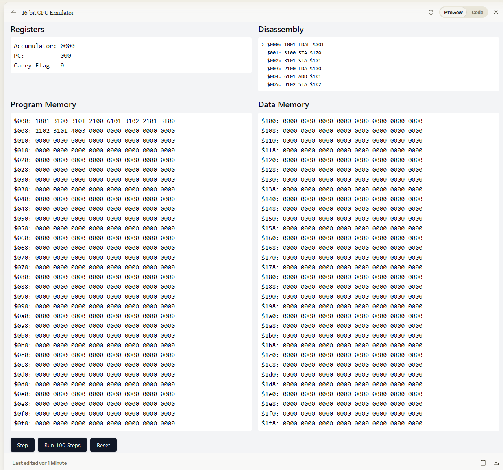

# 16-bit CPU with "Claude-3.5-Sonnet" - 30th June 2024

Zero shot prompting with Claude Sonnets (Except the javascript emulator, where i had to refine the prompt and use multiple generations).

This challenge does not seem to present any problem for Sonnet-3.5. 

## The CPU

This prompt was updated to include an implicit load instruction, which was missing in previous versions.

### Prompt to generate ISA

```
Assume a 16-bit microprocessor in an accumulator based architecture. Register
are accumulator (16 bit), PC (12 bit) and carry flag. All instructions use
immediate addressing to a 12 bit memory address bus. The following instructions 
shall be implemented: LDAL #imm12, LDA mem12, STA mem12, BCC mem12, BCS mem12,ADD mem12, 
SUB mem12, AND mem12, XOR mem12. The instruction are encoded into 16 bit words. 
List all instructions including encoding for each of them on a concise way. 

Use this template:

1. LDA mem12: Load accumulator with value from memory address mem12
   - Encoding: `0000 | mem12`
```

### Output (generated by LLM)
Certainly. Here's a concise list of the instructions with their encodings based on the given specifications:

1. LDAL #imm12: Load accumulator with immediate 12-bit value
   - Encoding: `0001 | imm12`

2. LDA mem12: Load accumulator with value from memory address mem12
   - Encoding: `0010 | mem12`

3. STA mem12: Store accumulator value to memory address mem12
   - Encoding: `0011 | mem12`

4. BCC mem12: Branch to mem12 if carry flag is clear
   - Encoding: `0100 | mem12`

5. BCS mem12: Branch to mem12 if carry flag is set
   - Encoding: `0101 | mem12`

6. ADD mem12: Add value from memory address mem12 to accumulator
   - Encoding: `0110 | mem12`

7. SUB mem12: Subtract value from memory address mem12 from accumulator
   - Encoding: `0111 | mem12`

8. AND mem12: Perform bitwise AND between accumulator and value from memory address mem12
   - Encoding: `1000 | mem12`

9. XOR mem12: Perform bitwise XOR between accumulator and value from memory address mem12
   - Encoding: `1001 | mem12`

This encoding scheme uses the first 4 bits to specify the operation, followed by the 12-bit memory address or immediate value.

### Prompt to generate Python emulator

```
Implement a cpu emulator in a standalone python program that is able to emulate the cpu with the marked instruction set architecture. The status of the registers and executed instruction should be printed to the console for each cycle. The emulation should automatically stop after 20 cycles. The program that is to be executed is to be loaded from a text file that contains the code memory in binary representation. One line per instruction. The file name is given as an argument to the python program.
```


```python
import sys

class CPU:
    def __init__(self):
        self.accumulator = 0
        self.pc = 0
        self.carry_flag = False
        self.memory = [0] * 4096  # 12-bit address space

    def load_program(self, filename):
        with open(filename, 'r') as file:
            for i, line in enumerate(file):
                self.memory[i] = int(line.strip(), 2)

    def fetch(self):
        instruction = self.memory[self.pc]
        self.pc = (self.pc + 1) & 0xFFF  # Wrap around 12-bit address space
        return instruction

    def execute(self, instruction):
        opcode = (instruction >> 12) & 0xF
        operand = instruction & 0xFFF

        if opcode == 0b0001:  # LDAL
            self.accumulator = operand
        elif opcode == 0b0010:  # LDA
            self.accumulator = self.memory[operand]
        elif opcode == 0b0011:  # STA
            self.memory[operand] = self.accumulator
        elif opcode == 0b0100:  # BCC
            if not self.carry_flag:
                self.pc = operand
        elif opcode == 0b0101:  # BCS
            if self.carry_flag:
                self.pc = operand
        elif opcode == 0b0110:  # ADD
            result = self.accumulator + self.memory[operand]
            self.carry_flag = result > 0xFFFF
            self.accumulator = result & 0xFFFF
        elif opcode == 0b0111:  # SUB
            result = self.accumulator - self.memory[operand]
            self.carry_flag = result < 0
            self.accumulator = result & 0xFFFF
        elif opcode == 0b1000:  # AND
            self.accumulator &= self.memory[operand]
        elif opcode == 0b1001:  # XOR
            self.accumulator ^= self.memory[operand]

        return self.get_instruction_name(opcode)

    def get_instruction_name(self, opcode):
        instructions = {
            0b0001: "LDAL", 0b0010: "LDA", 0b0011: "STA", 0b0100: "BCC",
            0b0101: "BCS", 0b0110: "ADD", 0b0111: "SUB", 0b1000: "AND", 0b1001: "XOR"
        }
        return instructions.get(opcode, "UNKNOWN")

    def run(self, cycles):
        for i in range(cycles):
            instruction = self.fetch()
            executed_instruction = self.execute(instruction)
            self.print_status(i + 1, executed_instruction)

    def print_status(self, cycle, instruction):
        print(f"Cycle {cycle}:")
        print(f"  Executed: {instruction}")
        print(f"  Accumulator: {self.accumulator:04X}")
        print(f"  PC: {self.pc:03X}")
        print(f"  Carry Flag: {self.carry_flag}")
        print()

def main():
    if len(sys.argv) != 2:
        print("Usage: python cpu_emulator.py <filename>")
        sys.exit(1)

    filename = sys.argv[1]
    cpu = CPU()
    cpu.load_program(filename)
    cpu.run(20)

if __name__ == "__main__":
    main()
```

## javascript emulator

Since this seemed to easy, I asked to generate a javascript emulator with a GUI in addition. This can be directly previews in the Claude interface. I had to fine tune the prompt a bit, since it tended to generate a test program that used the same memory address for both data and program memory. I tried several generations until i found one where i liked the layout (i could have provided the layout instead).

The fibonacci program works nicely and the emulator can step through it with the gui. See screenshot below.

```
Implement a cpu emulator in javascript that is able to emulate the cpu with the given instruction set architecture. The status of the registers and local instruction disassembly plus hexcode (context windows: +- 5 instruction around PC) should be shown in a window. Make sure to align each column properly. Add an additional view to she the status of data memory (starting at $100) in compact hex encoding. Include gui elements for step-by-step execution and run 100 steps. include a simple fibonacci series program as an example. The program code shall start at memory address $000, the data at $100. 
```




```javascript
import React, { useState, useEffect } from 'react';
import { Button } from '@/components/ui/button';

// CPU Emulator
class CPU {
  constructor() {
    this.memory = new Uint16Array(4096);
    this.accumulator = 0;
    this.pc = 0;
    this.carryFlag = 0;
  }

  reset() {
    this.accumulator = 0;
    this.pc = 0;
    this.carryFlag = 0;
  }

  loadProgram(program) {
    for (let i = 0; i < program.length; i++) {
      this.memory[i] = program[i];
    }
  }

  fetch() {
    return this.memory[this.pc++];
  }

  execute(instruction) {
    const opcode = instruction >> 12;
    const operand = instruction & 0xFFF;

    switch (opcode) {
      case 0x1: // LDAL
        this.accumulator = operand;
        break;
      case 0x2: // LDA
        this.accumulator = this.memory[operand];
        break;
      case 0x3: // STA
        this.memory[operand] = this.accumulator;
        break;
      case 0x4: // BCC
        if (!this.carryFlag) this.pc = operand;
        break;
      case 0x5: // BCS
        if (this.carryFlag) this.pc = operand;
        break;
      case 0x6: // ADD
        const sum = this.accumulator + this.memory[operand];
        this.carryFlag = sum > 0xFFFF ? 1 : 0;
        this.accumulator = sum & 0xFFFF;
        break;
      case 0x7: // SUB
        const diff = this.accumulator - this.memory[operand];
        this.carryFlag = diff < 0 ? 1 : 0;
        this.accumulator = diff & 0xFFFF;
        break;
      case 0x8: // AND
        this.accumulator &= this.memory[operand];
        break;
      case 0x9: // XOR
        this.accumulator ^= this.memory[operand];
        break;
    }
  }

  step() {
    const instruction = this.fetch();
    this.execute(instruction);
  }

  run(steps) {
    for (let i = 0; i < steps; i++) {
      this.step();
    }
  }
}

// Disassembler
function disassemble(instruction) {
  const opcode = instruction >> 12;
  const operand = instruction & 0xFFF;
  const opcodes = ['', 'LDAL', 'LDA', 'STA', 'BCC', 'BCS', 'ADD', 'SUB', 'AND', 'XOR'];
  return `${opcodes[opcode]} $${operand.toString(16).padStart(3, '0')}`;
}

// CPU Emulator Component
const CPUEmulator = () => {
  const [cpu] = useState(new CPU());
  const [, setRefresh] = useState(0);

  useEffect(() => {
    // Fibonacci program
    const program = [
      0x1001, // LDAL 1
      0x3100, // STA $100
      0x3101, // STA $101
      0x2100, // LDA $100
      0x6101, // ADD $101
      0x3102, // STA $102
      0x2101, // LDA $101
      0x3100, // STA $100
      0x2102, // LDA $102
      0x3101, // STA $101
      0x4003  // BCC $003
    ];
    cpu.loadProgram(program);
    setRefresh(prev => prev + 1);
  }, [cpu]);

  const handleStep = () => {
    cpu.step();
    setRefresh(prev => prev + 1);
  };

  const handleRun100 = () => {
    cpu.run(100);
    setRefresh(prev => prev + 1);
  };

  const handleReset = () => {
    cpu.reset();
    setRefresh(prev => prev + 1);
  };

  const renderMemory = (start, end) => {
    let rows = [];
    for (let i = start; i < end; i += 8) {
      let row = `$${i.toString(16).padStart(3, '0')}: `;
      for (let j = 0; j < 8; j++) {
        if (i + j < end) {
          row += cpu.memory[i + j].toString(16).padStart(4, '0') + ' ';
        }
      }
      rows.push(<div key={i}>{row}</div>);
    }
    return rows;
  };

  const renderDisassembly = () => {
    const start = Math.max(0, cpu.pc - 5);
    const end = Math.min(cpu.memory.length, cpu.pc + 6);
    return Array.from({length: end - start}, (_, i) => {
      const address = start + i;
      const instruction = cpu.memory[address];
      const disassembled = disassemble(instruction);
      const hex = instruction.toString(16).padStart(4, '0');
      const arrow = address === cpu.pc ? '>' : ' ';
      return (
        <div key={address} style={{fontFamily: 'monospace'}}>
          {arrow} ${address.toString(16).padStart(3, '0')}: {hex} {disassembled}
        </div>
      );
    });
  };

  return (
    <div className="p-4 bg-gray-100 rounded-lg">
      <h1 className="text-2xl font-bold mb-4">16-bit CPU Emulator</h1>
      <div className="grid grid-cols-2 gap-4">
        <div>
          <h2 className="text-xl font-semibold mb-2">Registers</h2>
          <pre className="bg-white p-2 rounded">
            {`Accumulator: ${cpu.accumulator.toString(16).padStart(4, '0')}
PC:          ${cpu.pc.toString(16).padStart(3, '0')}
Carry Flag:  ${cpu.carryFlag}`}
          </pre>
        </div>
        <div>
          <h2 className="text-xl font-semibold mb-2">Disassembly</h2>
          <pre className="bg-white p-2 rounded">
            {renderDisassembly()}
          </pre>
        </div>
        <div>
          <h2 className="text-xl font-semibold mb-2">Program Memory</h2>
          <pre className="bg-white p-2 rounded">
            {renderMemory(0, 0x100)}
          </pre>
        </div>
        <div>
          <h2 className="text-xl font-semibold mb-2">Data Memory</h2>
          <pre className="bg-white p-2 rounded">
            {renderMemory(0x100, 0x200)}
          </pre>
        </div>
      </div>
      <div className="mt-4 space-x-2">
        <Button onClick={handleStep}>Step</Button>
        <Button onClick={handleRun100}>Run 100 Steps</Button>
        <Button onClick={handleReset}>Reset</Button>
      </div>
    </div>
  );
};

export default CPUEmulator;    
```

## Verilog implemenation

```
Write a single verilog module that implements this architecture. Inputs shall be: clk,reset, datain (16 bit). Output: adrout(12 bit), dataout (16 bit), write enable.
This is a von-neumann computer with shared Memory. The memory is implemented externally as a standard parallel SRAM and is accessed via the modules interface. You may have to implement a state machine to handle multi-cycle instructions that access the memory. Please also generated a testbench including a fibonacci  series test program
```

```verilog
// 16-bit CPU Module
module cpu_16bit (
    input wire clk,
    input wire reset,
    input wire [15:0] datain,
    output reg [11:0] adrout,
    output reg [15:0] dataout,
    output reg write_enable
);

    // Registers
    reg [15:0] accumulator;
    reg [11:0] pc;
    reg carry_flag;

    // State machine states
    localparam FETCH = 2'b00, DECODE = 2'b01, EXECUTE = 2'b10, MEMORY = 2'b11;
    reg [1:0] state, next_state;

    // Instruction decoding
    wire [3:0] opcode = datain[15:12];
    wire [11:0] operand = datain[11:0];

    // State machine
    always @(posedge clk or posedge reset) begin
        if (reset) begin
            state <= FETCH;
            pc <= 12'b0;
            accumulator <= 16'b0;
            carry_flag <= 1'b0;
            write_enable <= 1'b0;
        end else begin
            state <= next_state;
        end
    end

    // Next state logic
    always @(*) begin
        case (state)
            FETCH: next_state = DECODE;
            DECODE: next_state = EXECUTE;
            EXECUTE: begin
                case (opcode)
                    4'h2, 4'h3, 4'h6, 4'h7, 4'h8, 4'h9: next_state = MEMORY;
                    default: next_state = FETCH;
                endcase
            end
            MEMORY: next_state = FETCH;
            default: next_state = FETCH;
        endcase
    end

    // Datapath and control logic
    always @(posedge clk) begin
        case (state)
            FETCH: begin
                adrout <= pc;
                pc <= pc + 1;
                write_enable <= 1'b0;
            end
            EXECUTE: begin
                case (opcode)
                    4'h1: accumulator <= {4'b0, operand}; // LDAL
                    4'h2: adrout <= operand; // LDA (prepare address)
                    4'h3: begin // STA
                        adrout <= operand;
                        dataout <= accumulator;
                        write_enable <= 1'b1;
                    end
                    4'h4: if (!carry_flag) pc <= operand; // BCC
                    4'h5: if (carry_flag) pc <= operand; // BCS
                    4'h6, 4'h7, 4'h8, 4'h9: adrout <= operand; // ADD, SUB, AND, XOR (prepare address)
                endcase
            end
            MEMORY: begin
                write_enable <= 1'b0;
                case (opcode)
                    4'h2: accumulator <= datain; // LDA
                    4'h6: {carry_flag, accumulator} <= accumulator + datain; // ADD
                    4'h7: {carry_flag, accumulator} <= accumulator - datain; // SUB
                    4'h8: accumulator <= accumulator & datain; // AND
                    4'h9: accumulator <= accumulator ^ datain; // XOR
                endcase
            end
        endcase
    end

endmodule

// Testbench
module cpu_16bit_tb;
    reg clk, reset;
    reg [15:0] datain;
    wire [11:0] adrout;
    wire [15:0] dataout;
    wire write_enable;

    // Instantiate the CPU
    cpu_16bit uut (
        .clk(clk),
        .reset(reset),
        .datain(datain),
        .adrout(adrout),
        .dataout(dataout),
        .write_enable(write_enable)
    );

    // Clock generation
    always #5 clk = ~clk;

    // Memory simulation
    reg [15:0] memory [0:4095];

    // Initialize memory with Fibonacci program
    initial begin
        memory[0] = 16'h1001; // LDAL 1
        memory[1] = 16'h3100; // STA $100
        memory[2] = 16'h3101; // STA $101
        memory[3] = 16'h2100; // LDA $100
        memory[4] = 16'h6101; // ADD $101
        memory[5] = 16'h3102; // STA $102
        memory[6] = 16'h2101; // LDA $101
        memory[7] = 16'h3100; // STA $100
        memory[8] = 16'h2102; // LDA $102
        memory[9] = 16'h3101; // STA $101
        memory[10] = 16'h4003; // BCC $003
    end

    // Memory read/write logic
    always @(posedge clk) begin
        if (write_enable)
            memory[adrout] <= dataout;
        datain <= memory[adrout];
    end

    // Test sequence
    initial begin
        $dumpfile("cpu_16bit_tb.vcd");
        $dumpvars(0, cpu_16bit_tb);

        clk = 0;
        reset = 1;
        #10 reset = 0;

        // Run for 200 clock cycles
        #2000;

        // Display Fibonacci sequence
        $display("Fibonacci Sequence:");
        $display("memory[100] = %d", memory[16'h100]);
        $display("memory[101] = %d", memory[16'h101]);
        $display("memory[102] = %d", memory[16'h102]);

        $finish;
    end

endmodule
```
